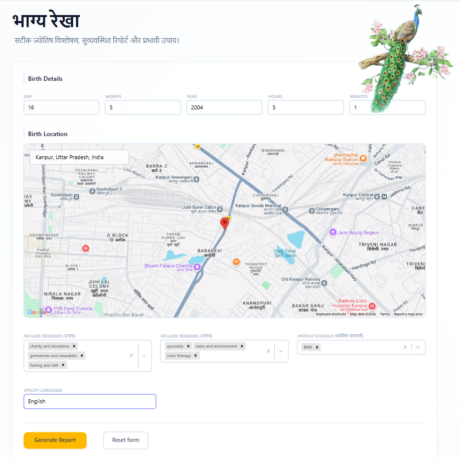
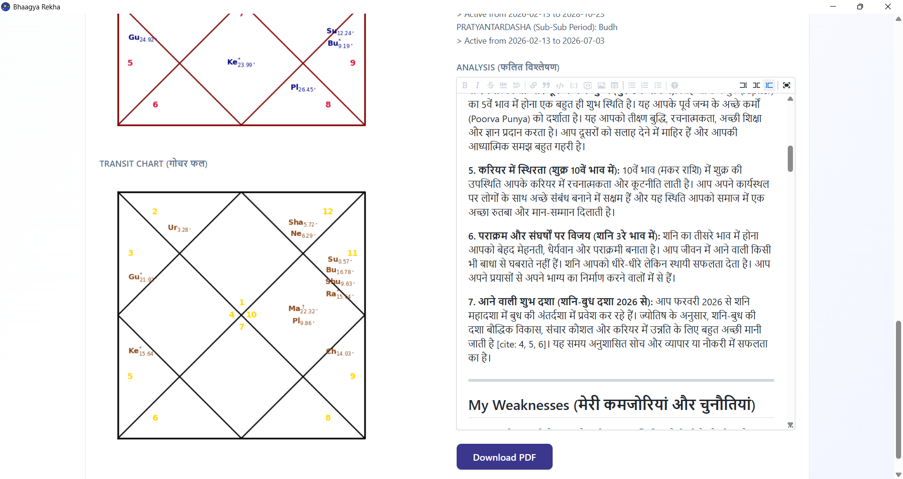

<div align="center">

# भाग्य रेखा · Bhaagya Rekha

### *An AI-powered Vedic astrology engine that turns your birth details into a deeply researched, personalized life report.*

*Sidereal calculations. Dasha timelines. Gochar transits. Remedies tailored to your beliefs.*


</div>

---

## Overview

**Bhaagya Rekha** (literally *"line of fortune"*) is a desktop application that bridges classical Jyotish (Vedic astrology) with modern AI research. You enter your birth date, time, and place — it computes your sidereal birth chart, full Vimshottari dasha timeline, and current planetary transits using the Swiss Ephemeris, then dispatches that context to a **Gemini Deep Research agent** which consults books, websites, and multiple astrological traditions to produce a structured, personalized report with strengths, weaknesses, and actionable remedies.

The result is delivered as a live, editable markdown report directly in-app, complete with rendered kundli and gochar chakras, and can be exported as a clean PDF.

<div align="center">
  
  <p><em>Birth details, location, and preferences — the starting point of every analysis.</em></p>
</div>

---

## What It Promises to Deliver

- **Astronomical accuracy** — Sidereal positions computed via the Swiss Ephemeris (Lahiri ayanamsa), not approximated.
- **Complete chart picture** — D1 (Rashi) kundli, Lagna gochar (current transits), and full Vimshottari Dasha with Mahadasha → Antardasha → Pratyantardasha hierarchy.
- **Multi-tradition synthesis** — Pulls simultaneously from Vedic (Parashari), BNN (Bhrigu Nandi Nadi), and KP (Krishnamurti Paddhati) schools. Custom schools supported.
- **Personalized remedies** — Include or exclude remedy categories (mantras, yantras, gemstones, donations, lifestyle, etc.) based on what you actually believe in or can practice.
- **Multilingual output** — Report generated in any language you specify (English, Hindi, and beyond).
- **Privacy by design** — Runs as a native desktop app on your machine. Your birth data never touches a third-party web service beyond the AI research call.
- **Caching that remembers** — Identical birth data + preferences returns a cached report instantly. No rework, no re-billing.
- **Exportable PDF** — Publication-quality report with embedded charts and Devanagari typography.

---

## Core Capabilities

### Astrology Engine
| Feature | Detail |
|---|---|
| **Sidereal calculations** | Swiss Ephemeris with Lahiri ayanamsa |
| **Planets tracked** | Surya, Chandra, Mangal, Budh, Guru, Shukra, Shani, Rahu, Ketu, Uranus, Neptune, Pluto |
| **Chart generation** | D1 (Rashi) chakra rendered as a publication-quality PNG |
| **Dasha system** | Full Vimshottari — Mahadasha, Antardasha, Pratyantardasha |
| **Transits** | Live Lagna Gochar computed for the current moment |
| **Dignity analysis** | Exaltation, debilitation, combustion, retrograde, natural & temporary relationships, functional benefic/malefic nature |

### AI Research Layer
| Feature | Detail |
|---|---|
| **Agent** | Google Gemini Deep Research (`deep-research-pro-preview-12-2025`) |
| **Input** | Structured kundli + dasha + gochar summary, rendered chakra images, and user preferences |
| **Output sections** | Strengths · Weaknesses · Remedies · Pros & Cons · Conclusion |
| **Async workflow** | Background dispatch + poll; resume seamlessly if you close and reopen the app |
| **Persistence** | Reports cached in MongoDB keyed by prompt fingerprint |

### User Experience
- **Map-based location picker** — Click anywhere on Google Maps to set birth coordinates precisely.
- **Creatable preference selectors** — Pick from defaults or define your own Jyotish schools and remedy categories on the fly.
- **Form state preservation** — All inputs stored in `localStorage`; you never lose your work on accidental close.
- **Keyboard shortcuts** — `Enter` to generate, `Esc` to clear.
- **Live status** — In-progress / completed / failed states with Lottie animations, so you always know where you stand.
- **Inline markdown editor** — Edit the generated report in place before exporting.

<div align="center">
  
  <p><em>A finished report with rendered kundli, gochar, dasha timeline, and AI-generated remedies — fully editable, PDF-ready.</em></p>
</div>

---

## How to Use

### The easy way — prebuilt executable

A ready-to-run Windows build is shipped in the [`executables/`](executables/) folder.

1. Open the [`executables/`](executables/) directory.
2. Double-click **`Bhaagya Rekha.exe`**.
3. The app opens in a native window. Fill in the form and click **Generate Report**.

That's it. No Python, Node, or toolchain required.

> The executable bundles the Flask backend, React frontend, Swiss Ephemeris data, and Devanagari fonts into a single self-contained binary via PyInstaller.

### Filling out the form

1. **Birth Details** — Day, Month, Year, Hours (24-hour IST), Minutes.
2. **Birth Location** — Click the map to pin the place of birth. Latitude and longitude populate automatically.
3. **Preferences** *(optional)*
   - *Include Remedies* — e.g. *Mantras*, *Yantras*, *Gemstones*, *Donations*.
   - *Exclude Remedies* — anything you don't want suggested.
   - *Jyotish Schools* — *Vedic*, *BNN*, *KP*, or add your own.
   - *Language* — Any language name ("English", "Hindi", "Marathi", …).
   - *Gender* — Male / Female / Not Known.
4. **Generate Report** — Click the button (or press `Enter`). The app dispatches the research job and polls for completion. Generation typically takes a few minutes.
5. **Review & Edit** — Once ready, the report renders below with both chakras. Edit the markdown directly if you want to tweak anything.
6. **Export** — Download a fully-formatted PDF with your charts embedded.

---

## Tech Stack

### Backend
- **Python 3.10** · Flask 3.1 · Flask-CORS
- **pyswisseph** — astronomical calculations
- **google-genai** — Gemini Deep Research client
- **pymongo** — report caching
- **matplotlib** — chakra rendering
- **xhtml2pdf** — PDF export
- **pywebview** — native desktop shell
- **PyInstaller** — single-binary packaging

### Frontend
- **React 19** with the new React Compiler
- **TypeScript 5.9**
- **Vite 7** build tooling
- **Tailwind CSS 4** for styling
- **@vis.gl/react-google-maps** — map picker
- **@uiw/react-md-editor** — in-app markdown editing
- **html2pdf.js** & **@react-pdf/renderer** — client-side export
- **react-hot-toast** · **lottie-react** · **react-select**

### Infrastructure
- **MongoDB** — report cache (optional; the app degrades gracefully without it)
- **Swiss Ephemeris** data files bundled in the binary
- **Noto Sans Devanagari** for clean Hindi rendering in PDFs

---

## Building from Source

If you want to hack on the app or produce your own executable:

```bat
:: Windows
build.bat
```

What it does:
1. Creates a Python 3.10 venv and installs `requirements.txt`.
2. Builds the React frontend (`npm run build` inside `frontend/`).
3. Runs PyInstaller with `app.spec` to produce `executables/Bhaagya Rekha.exe`.

### Environment variables

Create a `.env` in the project root:

```
GEMINI_API_KEY=your_google_genai_key
MONGO_URI=mongodb://localhost:27017/bhaagya_rekha   # optional but recommended
```

### Running in dev mode

```bash
# Backend
python app.py                    # Flask on :5000

# Frontend (separate terminal)
cd frontend
npm install
npm run dev                      # Vite dev server
```

---

## Project Layout

```
kundli-analyzer/
├── app.py                 # Flask API (start-analysis, get-analysis, download-pdf)
├── desktop.py             # pywebview shell that wraps Flask in a native window
├── analysis.py            # Gemini Deep Research dispatch + caching
├── kundli.py              # D1 chart construction and rendering
├── dasha.py               # Vimshottari dasha computation
├── gochar.py              # Transit chart computation
├── download.py            # PDF report generation
├── utils.py               # Sidereal math, validation, prompt assembly
├── constants.py           # Planets, rashis, nakshatras, dasha tables
├── app.spec               # PyInstaller spec
├── build.bat              # One-click build script
├── executables/
│   └── Bhaagya Rekha.exe  # Prebuilt Windows binary
├── fonts/                 # Noto Sans Devanagari
├── frontend/              # React + Vite + Tailwind UI
└── screenshots/           # README images
```

---

## A Note on the Name

**भाग्य रेखा** (*Bhaagya Rekha*) — the line of fortune. A reminder that while the stars describe the terrain, the walking is still yours.

<div align="center">
  <br/>
  <sub>Made with care for those who look up.</sub>
</div>
